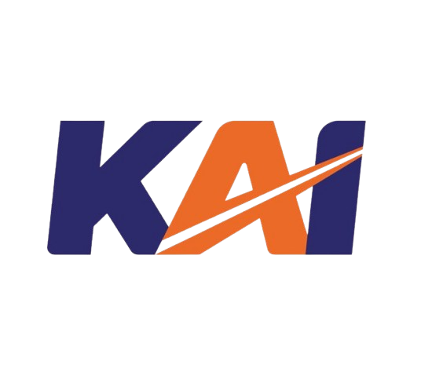

# 🚂 KAI Overhauled - Sistem Informasi Kereta Api Indonesia

  

  <strong>Platform digital modern untuk layanan informasi PT Kereta Api Indonesia</strong>

  
  
  
  

## 📋 Deskripsi Project

**KAI Overhauled** adalah sebuah platform web modern yang dikembangkan untuk memberikan layanan informasi terpadu mengenai PT Kereta Api Indonesia (KAI). Sistem ini dirancang dengan antarmuka yang user-friendly dan fitur-fitur komprehensif untuk memenuhi kebutuhan informasi pengguna terkait layanan kereta api di Indonesia.

Platform ini menggabungkan teknologi web terkini dengan desain yang responsif dan interaktif, memberikan pengalaman pengguna yang optimal dalam mengakses berbagai informasi dan layanan KAI.

## ✨ Fitur-Fitur Utama

### 🏠 **Homepage & Landing**
- **Hero Section** dengan slideshow dinamis dan animasi modern
- **Quick Actions** untuk akses cepat ke fitur utama
- **Latest News** dengan preview artikel terbaru
- **Service Highlights** menampilkan layanan unggulan KAI
- **Statistics Dashboard** dengan data real-time
- **Responsive Design** yang optimal di semua perangkat

### 🔍 **Sistem Pencarian Tiket**
- **Advanced Search** dengan filter stasiun asal dan tujuan
- **Date Picker** untuk pemilihan tanggal keberangkatan
- **Passenger Selection** untuk berbagai kategori penumpang
- **Real-time Results** menampilkan jadwal dan harga terkini
- **Route Information** dengan detail perjalanan lengkap
- **Booking Guidance** dengan panduan pemesanan tiket

### 🤖 **Chatbot AI Assistant**
- **Interactive Chatbot** dengan AI-powered responses
- **Quick Actions** untuk pertanyaan umum (jadwal, layanan, berita)
- **Greeting & Closing** responses yang natural
- **Contextual Help** berdasarkan topik pertanyaan
- **Multi-language Support** dengan fokus Bahasa Indonesia
- **Smart Fallback** untuk pertanyaan yang tidak dikenali

### 📰 **Sistem Berita & Informasi**
- **News Management** dengan artikel terbaru KAI
- **Rich Text Editor** untuk konten berita
- **Image Gallery** dengan galeri foto artikel
- **Social Sharing** untuk berbagi artikel di media sosial
- **Related Articles** untuk artikel terkait
- **SEO Optimized** untuk visibilitas search engine

### 🏛️ **Manajemen Stasiun**
- **Station Directory** dengan database stasiun lengkap
- **Location Mapping** dengan integrasi Google Maps
- **Geolocation Support** untuk deteksi lokasi otomatis
- **Station Details** dengan informasi fasilitas
- **Search & Filter** untuk pencarian stasiun
- **Mobile-Friendly** interface untuk akses mobile

### 🚂 **Manajemen Jadwal & Rute**
- **Schedule Management** dengan jadwal kereta real-time
- **Route Planning** untuk perencanaan perjalanan
- **Train Information** dengan detail kereta dan fasilitas
- **Price Management** dengan sistem harga dinamis
- **Seat Availability** dengan informasi ketersediaan tempat duduk
- **Multi-class Support** untuk berbagai kelas kereta

### 🏢 **Layanan & Fasilitas**
- **Service Catalog** dengan daftar layanan KAI lengkap
- **Facility Information** dengan detail fasilitas stasiun
- **Customer Support** dengan informasi kontak dan bantuan
- **FAQ Section** dengan pertanyaan yang sering diajukan
- **Download Center** untuk dokumen dan formulir
- **Accessibility Features** untuk kemudahan akses

### 👨‍💼 **Admin Dashboard**
- **Content Management System** untuk pengelolaan konten
- **User Management** dengan sistem role dan permission
- **Analytics Dashboard** dengan statistik penggunaan
- **Data Management** untuk CRUD operations
- **Report Generation** dengan laporan komprehensif
- **System Monitoring** untuk monitoring performa

### 🔐 **Keamanan & Privacy**
- **Cookie Consent** dengan glassmorphism design
- **Privacy Policy** yang komprehensif dan user-friendly
- **Terms of Service** dengan ketentuan penggunaan jelas
- **Data Protection** dengan enkripsi dan keamanan berlapis
- **GDPR Compliance** untuk perlindungan data pengguna
- **Secure Authentication** dengan sistem login yang aman

### 📱 **User Experience**
- **Responsive Design** yang optimal di desktop, tablet, dan mobile
- **Progressive Web App** features untuk pengalaman app-like
- **Fast Loading** dengan optimasi performa tinggi
- **Accessibility** dengan dukungan screen reader dan keyboard navigation
- **Multi-browser Support** kompatibel dengan semua browser modern
- **Offline Support** untuk akses terbatas tanpa internet

### 🎨 **Design & Interface**
- **Modern UI/UX** dengan design system yang konsisten
- **Glassmorphism Effects** untuk elemen visual yang menarik
- **Smooth Animations** dengan micro-interactions yang halus
- **Color Scheme** yang mengikuti brand guidelines KAI
- **Typography** yang readable dan professional
- **Icon System** dengan Font Awesome integration

### 🔧 **Technical Features**
- **Laravel Framework** dengan arsitektur MVC yang robust
- **Database Optimization** dengan query yang efficient
- **API Integration** untuk layanan eksternal
- **Caching System** untuk performa yang optimal
- **Error Handling** dengan logging dan monitoring
- **Code Quality** dengan clean code principles

## 👥 Tim Pengembang

<table>
  <tr>
    <td align="center">
       
      <b>Bagas Pratama Junianika</b> 
      Fullstack Developer
    </td>
    <td align="center">
       
      <b>Hiban Dairobi</b> 
      Research & Quality Assurance
    </td>
    <td align="center">
       
      <b>Rayyan Haifan Naqi</b> 
      Frontend Developer & Editor
    </td>
  </tr>
</table>

### 🎯 Kontribusi Tim

- **Bagas Pratama Junianika** - Bertanggung jawab atas pengembangan backend dan frontend, arsitektur sistem, database design, dan integrasi fitur-fitur utama
- **Hiban Dairobi** - Melakukan research mendalam, quality assurance testing, user experience analysis, dan memastikan kualitas produk akhir
- **Rayyan Haifan Naqi** - Fokus pada pengembangan frontend, UI/UX design implementation, content editing, dan optimasi visual interface

## 🚀 Teknologi yang Digunakan

- **Backend**: Laravel 11.x, PHP 8.2+
- **Frontend**: Blade Templates, TailwindCSS, Alpine.js
- **Database**: MySQL 8.0+
- **Authentication**: Laravel Sanctum
- **File Storage**: Laravel Storage
- **Icons**: Font Awesome 6
- **Maps**: Google Maps API
- **Deployment**: Apache/Nginx, Linux Server

## 📞 Kontak & Support

Untuk pertanyaan, saran, atau dukungan teknis, silakan hubungi tim pengembang melalui:

- **Email**: support@kai-overhauled.com
- **GitHub**: [KAI Overhauled Repository](https://github.com/bagaspra16/kai-overhauled)
- **Documentation**: [Project Wiki](https://github.com/bagaspra16/kai-overhauled/wiki)

---

  Dikembangkan dengan ❤️ untuk PT Kereta Api Indonesia 
  © 2024 KAI Overhauled Team. All rights reserved.

